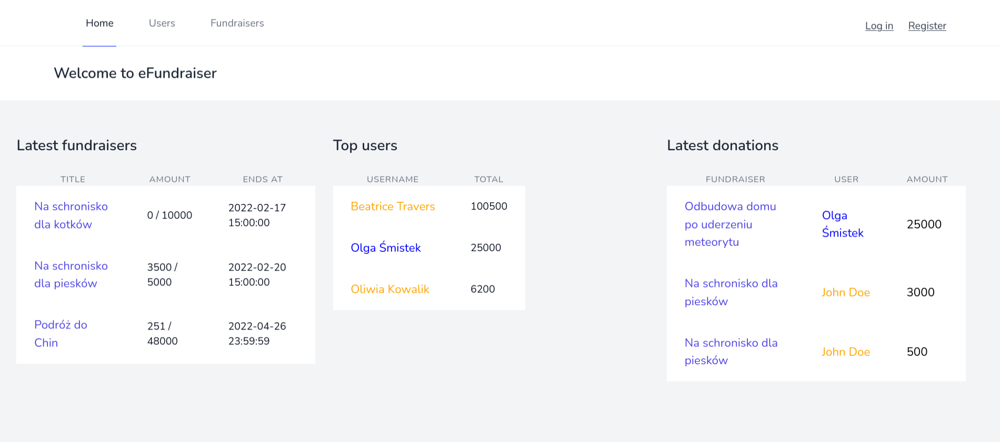
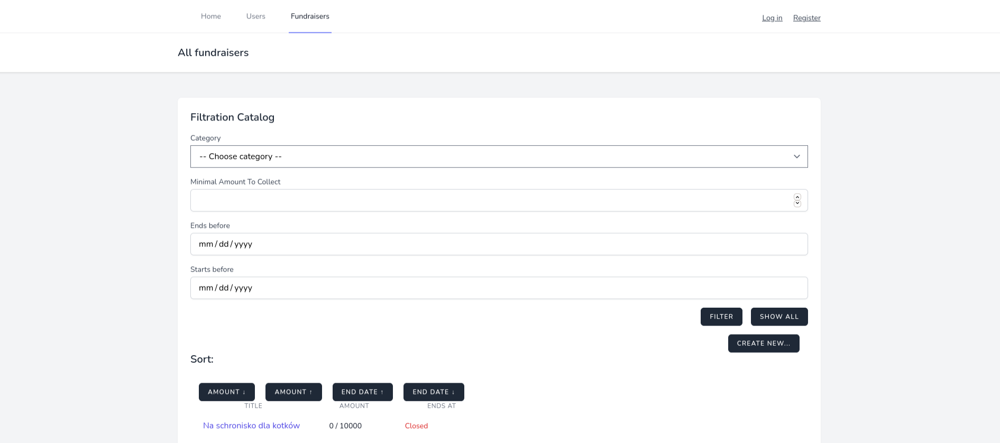
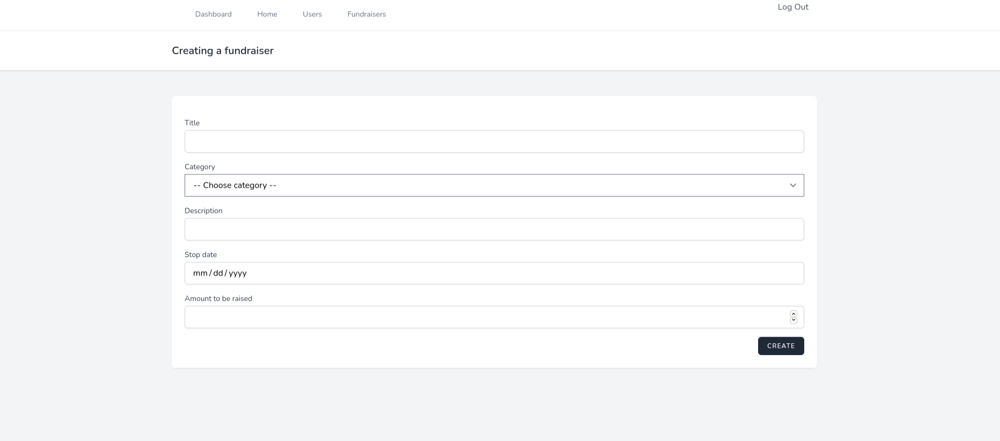
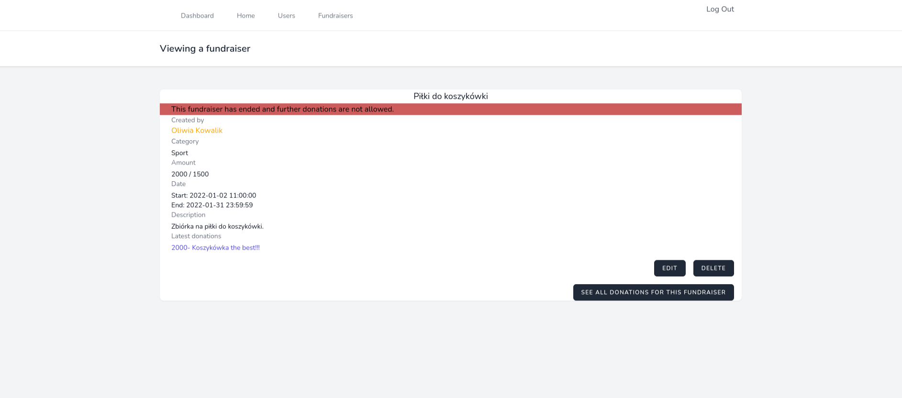
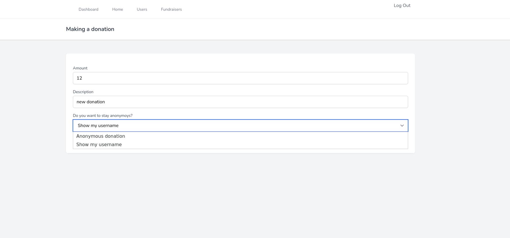
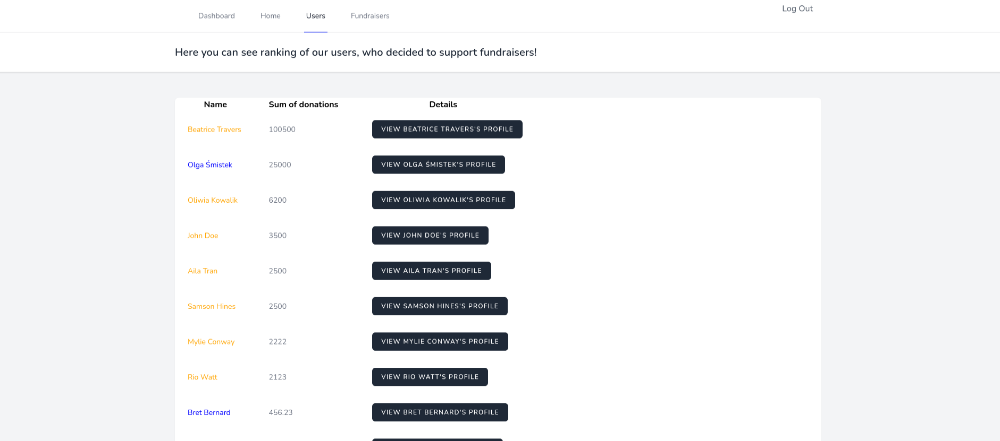

# eFundraiser
Web application for creating and donating online fundraisers.
### Description
The home page contains lately created fundraisers, latest
donations and top users. Guests can browse all open fundraisers 
and their donations. They can also see users ranking, where users 
are ordered by total amount of donations. Every fundraiser contains
information like category, description, current and target amount,
latest donations. List of fundraisers can be filtered and sorted. 
Most active users in current week have their username in gold.

To make a donation you have to sign up, then you can choose if you
want to stay anonymous or share your username. To create a new fundraiser
you have to be a verified user.

### Screenshots:

Main view is a list of latest fundraisers, donations and top users.

By choosing one of the options on navigation bar you can easily switch to list of all fundraisers which you can filer and sort through all of features.

Guest can only scroll through website, users can make a donations and verified ones can even create them own fundraisers.

Every fundraiser has details such as owner, title, description, amount to be raised, amount raised and latest donations. 

User can make a donation by using simple form, every donation can be public or annonymous.

There is also a ranking users. Most active ones are specially marked (name is orange instead of blue).

